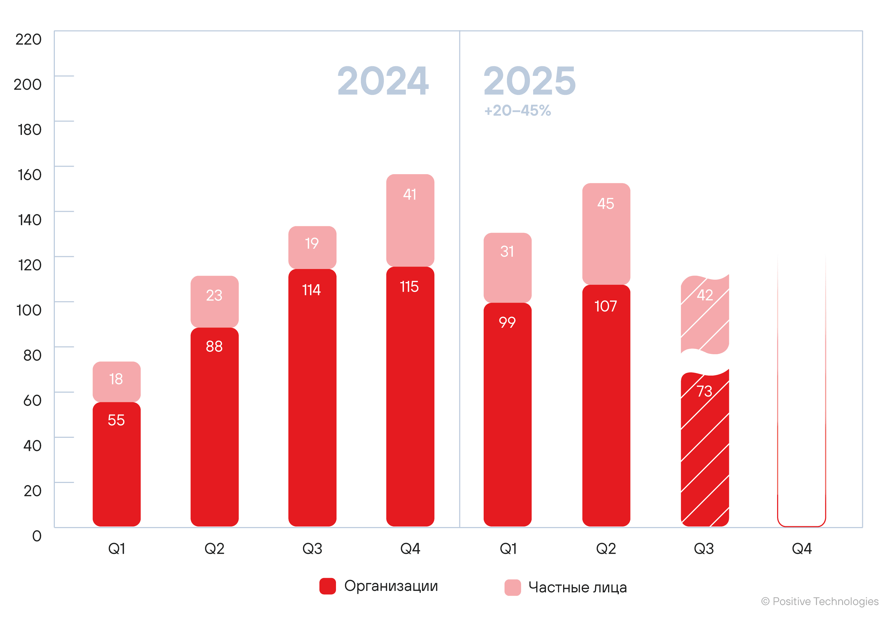
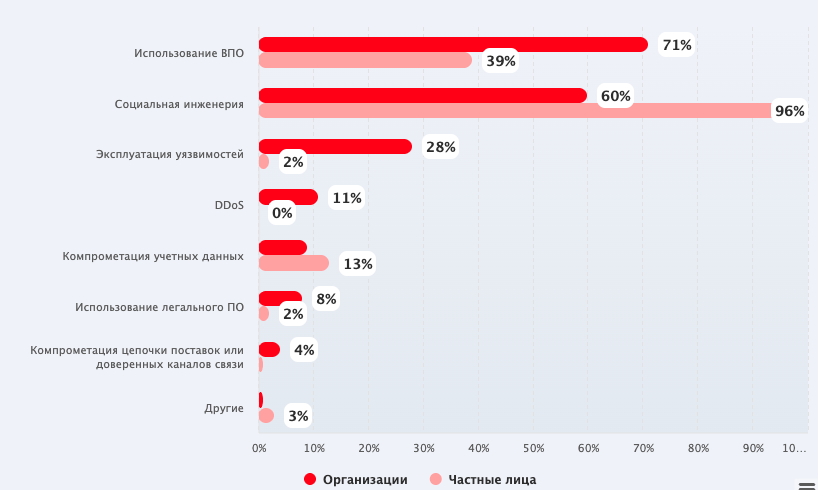
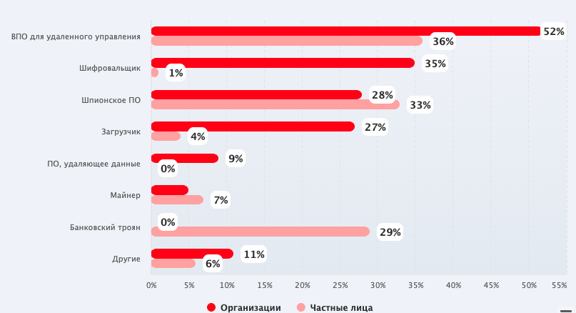
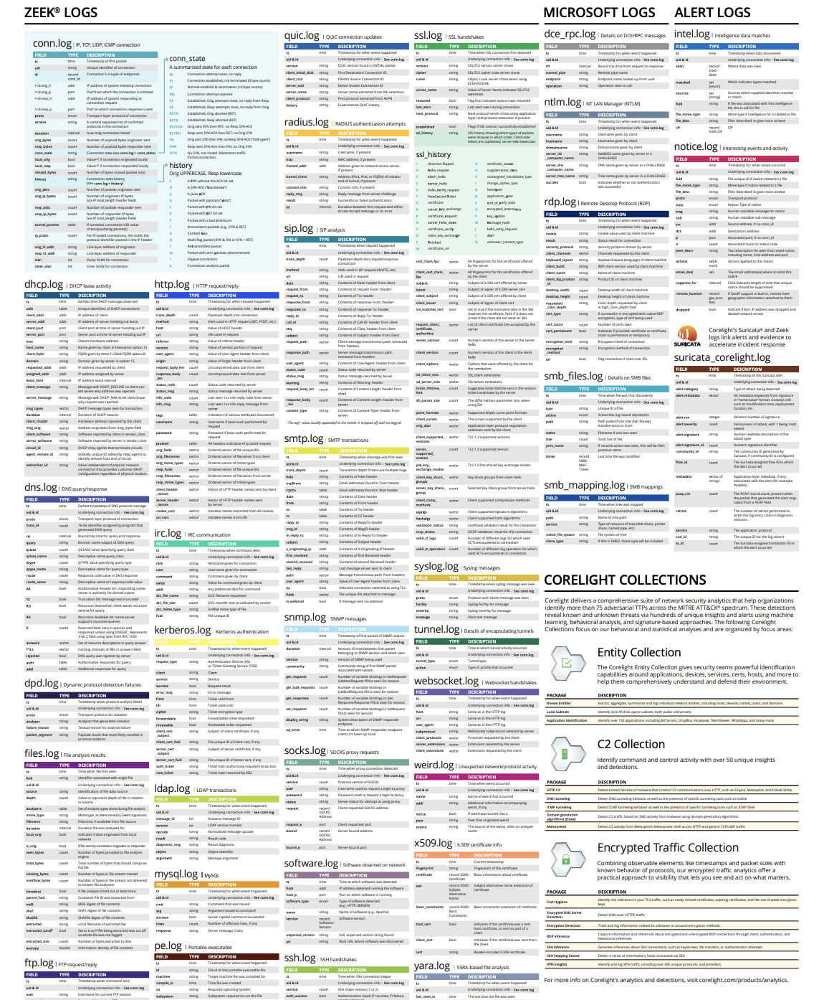
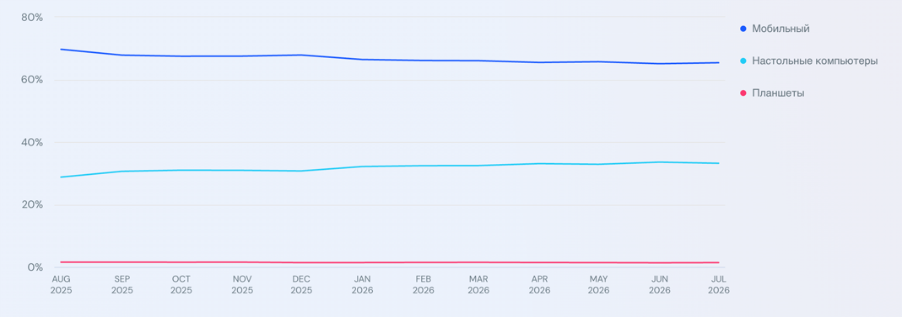

# **СОДЕРЖАНИЕ** {#содержание .TOC-Heading}

[ВВЕДЕНИЕ [2](#введение)](#введение)

[ГЛАВА 1. ТЕОРЕТИКО-МЕТОДИЧЕСКИЕ ОСНОВЫ ПРОЕКТИРОВАНИЯ СИСТЕМЫ ЗАЩИТЫ ОТ ВРЕДОНОСНОЙ СЕТЕВОЙ АКТИВНОСТИ С ИСПОЛЬЗОВАНИЕМ ПОВЕДЕНЧЕСКОГО ПРОФИЛИРОВАНИЯ [4](#глава-1.-теоретико-методические-основы-проектирования-системы-защиты-от-вредоносной-сетевой-активности-с-использованием-поведенческого-профилирования)](#глава-1.-теоретико-методические-основы-проектирования-системы-защиты-от-вредоносной-сетевой-активности-с-использованием-поведенческого-профилирования)

[1.1 Анализ актуальных векторов сетевых атак [4](#анализ-актуальных-векторов-сетевых-атак)](#анализ-актуальных-векторов-сетевых-атак)

[1.2 Анализ решений по защите пользователей от подозрительной сетевой активности [6](#анализ-решений-по-защите-пользователей-от-подозрительной-сетевой-активности)](#анализ-решений-по-защите-пользователей-от-подозрительной-сетевой-активности)

[1.2.1 Мобильные анализаторы трафика [7](#мобильные-анализаторы-трафика)](#мобильные-анализаторы-трафика)

[1.2.2 Облачные сервисы фильтрации и мониторинга на уровне DNS [7](#облачные-сервисы-фильтрации-и-мониторинга-на-уровне-dns)](#облачные-сервисы-фильтрации-и-мониторинга-на-уровне-dns)

[1.2.3 DNS-серверы для локальных сетей [8](#dns-серверы-для-локальных-сетей)](#dns-серверы-для-локальных-сетей)

[1.2.4 Мобильные средства защиты от угроз [9](#мобильные-средства-защиты-от-угроз)](#мобильные-средства-защиты-от-угроз)

[1.2.5 Веб-браузеры со встроенной фильтрацией [10](#веб-браузеры-со-встроенной-фильтрацией)](#веб-браузеры-со-встроенной-фильтрацией)

[1.3 Традиционные подходы к выявлению подозрительной активности в сетевом трафике [11](#традиционные-подходы-к-выявлению-подозрительной-активности-в-сетевом-трафике)](#традиционные-подходы-к-выявлению-подозрительной-активности-в-сетевом-трафике)

[1.4 Применение алгоритмов машинного обучения для поиска аномалий в сетевом трафике [12](#применение-алгоритмов-машинного-обучения-для-поиска-аномалий-в-сетевом-трафике)](#применение-алгоритмов-машинного-обучения-для-поиска-аномалий-в-сетевом-трафике)

[1.5 Централизованный сбор и извлечение признаков сетевого трафика [14](#централизованный-сбор-и-извлечение-признаков-сетевого-трафика)](#централизованный-сбор-и-извлечение-признаков-сетевого-трафика)

[1.6 Взаимодействие с пользователем [16](#взаимодействие-с-пользователем)](#взаимодействие-с-пользователем)

[СПИСОК ИСПОЛЬЗОВАННЫХ ИСТОЧНИКОВ [19](#список-использованных-источников)](#список-использованных-источников)

# ВВЕДЕНИЕ

Актуальность темы. В современном мире невозможно обойтись без выхода в Интернет: общение, развлечения, образование -- все это можно найти в онлайн-пространстве. Огромное количество людей в качестве инструмента для доступа в сеть выбирают мобильный телефон. В последнее время наблюдается резкий рост использования сервисов по созданию виртуальной частной сети, однако данная технология применяется пользователями бездумно, многие обыватели не задумываются как такой способ подключения способен навредить их информационной безопасности. Рядовой пользователь может не догадываться о том, что используемый сервис пересылает личную информацию злоумышленнику. На фоне этого имеет место увеличение числа скомпрометированной информации и утекших данных, это подтверждает статистика компании F6 за 2025 год: 760 млн. строк с данными российских пользователей попали в утечки \[1\].

Степень научной разработанности. На сегодняшний день вопросам обнаружения аномалий в сетевом трафике и проектирования систем обнаружения вторжений посвящено большое количество научных работ. Глубоко изучены методы сигнатурного анализа и машинного обучения для выявления подозрительных действий в сети. Вместе с тем большинство существующих решений ориентированы на корпоративный сектор и требуют значительных вычислительных ресурсов и участия квалифицированных специалистов для правильной интерпретации журналов событий.

Проблема исследования. Отсутствие эффективного и удобного для рядового пользователя решения, которое обеспечивало бы комплексную защиту устройств от вредоносной сетевой активности.

***Объектом исследования являются*** системы мониторинга сетевых соединений и защиты пользователей от вредоносной сетевой активности.

***Предметом исследования выступают*** механизмы выявления аномалий в сетевом трафике с использованием поведенческого профилирования.

***Целью выпускной квалификационной работы*** является разработка многоуровневой системы защиты пользователей от вредоносной сетевой активности с использованием поведенческого профилирования.

***Для достижения цели поставлены и решены следующие задачи:***

1)  Проанализировать актуальные векторы сетевых атак;

2)  Провести анализ существующих решений в области систем по обнаружению подозрительной активности в сетевом трафике;

3)  Исследовать алгоритмы машинного обучения для реализации механизма поведенческого профилирования;

4)  Изучить работу анализатора сетевого трафика Zeek;

5)  Спроектировать серверную и клиентскую архитектуру системы;

Методы исследования. Анализ существующих решений в области систем по обнаружению подозрительной активности в сетевом трафике, комплексный анализ современных векторов сетевых атак, разработка конвейера обработки данных и пользовательского интерфейса.

Научная новизна. Предложена многоуровневая система защиты, комбинирующая метод поведенческого профилирования со статическим анализом индикаторов компрометации.

Практическая значимость. Результаты работы позволяют внедрить комплексное решение для защиты пользователей, состоящее из серверного анализатора и мобильного приложения. Система автоматически перехватывает трафик, выявляет подозрительную активность, оповещает пользователя о потенциально нежелательном трафике через мобильное приложение.

Структура работы. **!!!!!**

# ГЛАВА 1. ТЕОРЕТИКО-МЕТОДИЧЕСКИЕ ОСНОВЫ ПРОЕКТИРОВАНИЯ СИСТЕМЫ ЗАЩИТЫ ОТ ВРЕДОНОСНОЙ СЕТЕВОЙ АКТИВНОСТИ С ИСПОЛЬЗОВАНИЕМ ПОВЕДЕНЧЕСКОГО ПРОФИЛИРОВАНИЯ

## Анализ актуальных векторов сетевых атак

Несмотря на совершенствование средств защиты информации, именно конечный пользователь является главной целью злоумышленников. Ввиду роста использования российскими пользователями инструментов для организации защищенного доступа \[2\], прослеживается увеличение числа инцидентов информационной безопасности. Анализ актуальных векторов сетевых атак демонстрирует, что злоумышленники стали больше эксплуатировать доверие и техническую неосведомленность пользователей.

По данным компании Positive Technologies с июля 2024-го по сентябрь 2025 года на долю России пришлось от 14% до 16% всех успешных кибератак в мире \[3\]. На рисунке ниже представлена динамика успешных кибератак на организации и частных лиц в России (рис. 1.1).

{width="4.90011811023622in" height="3.4029472878390203in"}

Рисунок 1.1 -- Динамика успешных кибератак

Исходя из данной динамики можно сделать следующий вывод относительно частных лиц: наблюдается заметное увеличение числа атак на пользователей. Если в первой половине 2024 года фиксировалось 18-23 инцидента за квартал, то данный показатель вырос до 31-45 инцидентов в квартал за тот же временной промежуток в 2025 году, что на 53% больше.

Анализ гистограммы успешных атак относительно методов (рис. 1.2) показывает, что среди векторов воздействия преобладает социальная инженерия, на которую приходится 96%, однако стоит обратить внимание на второй по величине метод -- использование вредоносного программного обеспечения. Исходя из данных наблюдений складывается следующий вывод -- злоумышленники при воздействии на частных лиц делают акцент на человеческом факторе и доверчивости пользователей.

{width="5.08139435695538in" height="3.0438659230096237in"}

Рассматривая распределение долей успешных атак с использованием вредоносного программного обеспечения относительно частных лиц (рис. 1.3), можно заметить преобладание следующих типов: вредоносное программное обеспечение для удаленного управления, шпионское программное обеспечение, банковский троян. Данная статистика свидетельствует о том, что злоумышленники стремятся к максимально скрытному присутствию на устройстве жертвы, незаметно для пользователя крадут его личную информацию и пересылают ее на удаленный сервер для дальнейшей продажи.

{width="5.019902668416448in" height="2.727937445319335in"}

**Вывод по параграфу 1.1**

Подводя итог анализу актуальных векторов кибератак, можно сделать следующий вывод относительно частных лиц: имеется тенденция к росту числа инцидентов. При атаке на пользователя злоумышленники делают акцент на человеческий фактор и техническую неосведомленность граждан. Преступники стремятся к максимально незаметному присутствию на устройстве жертвы, об этом говорят преобладающие типы вредоносного программного обеспечения, а именно инструменты для удаленного управления, шпионские приложения и банковские трояны.

## 1.2 Анализ решений по защите пользователей от подозрительной сетевой активности

На сегодняшний день имеется большой выбор программных средств и архитектурных подходов, направленных на мониторинг сетевой активности пользователей.

### 1.2.1 Мобильные анализаторы трафика

Данные программные решения устанавливаются на смартфон клиента. Из-за соображений безопасности приложения не имеют прямого доступа к сетевому трафику телефона. Для решения проблемы подобные программные продукты используют встроенный системный механизм создания виртуальной частной сети, другими словами, мобильные приложения создают на устройстве виртуальный сетевой интерфейс и перенаправляют все сетевые пакеты через себя, то есть анализ метаданных соединений производится непосредственно в памяти устройства. Примерами такого типа приложений могут служить: GlassWire и PCAPdroid.

У такого подхода имеются несколько существенных недостатков. Так как выполнение анализа пакетов, сверка метаданных с индикаторами компрометации из баз данных осуществляется непосредственно на смартфоне, это создает избыточную нагрузку на процессор и оперативную память мобильного устройства, что вызывает заторможенность в работе и повышенный расход энергии аккумулятора. Так же стоит отметить, что в современных устройствах имеются встроенные механизмы операционной системы, которые направлены на оптимизацию заряда батареи и могут принудительно выгружать фоновую службу анализатора из памяти.

### 1.2.2 Облачные сервисы фильтрации и мониторинга на уровне DNS

При использовании данного типа реализации нет необходимости в установке какого-либо стороннего программного обеспечения на устройство клиента. Пользователь прописывает в настройках мобильного телефона адрес защищенного DNS-сервера, в свою очередь сервис сверяет все доменные имена, которые запрашивает устройство, с индикаторами компрометации из баз данных. Примерами таких сервисов могут служить: AdGuard DNS и NextDNS.

Данный подход имеет ряд проблем. Стоит обратить внимание на отсутствие возможности глубокого анализа содержимого сетевых пакетов, так как система не имеет доступа к полным URL-адресам, путям запросов и передаваемому контенту. Так же необходимо учитывать на наличие единой точки отказа -- при сбоях в сети провайдера DNS пользователь может полностью потерять доступ к интернету.

### 1.2.3 DNS-серверы для локальных сетей

Данный подход обеспечивает защиту клиента путем развертывания сервиса фильтрации непосредственно внутри локальной сети пользователя. Для реализации необходимо установить специализированное программное обеспечение на постоянно включенное устройство, которому в локальной сети назначается статический IP-адрес.

При стандартной конфигурации маршрутизатор автоматически передает подключаемым устройствам адрес DNS-сервера интернет-провайдера или свой собственный. После внедрения сетевого фильтра описанный выше принцип работы изменяется -- всем клиентам в качестве основного DNS-сервера назначается внутренний IP-адрес развернутого сетевого фильтра. В результате все устройства сети перестают обращаться к DNS-серверам провайдера напрямую и направляют трафик через общий узел, который отсекает рекламу и известные вредоносные сайты. Самым популярным программным решением, основанным на представленном походе, является Pi-hole.

Рассмотренное решение обладает рядом ограничений. Слабым местом такого архитектурного метода является зависимость от одного локального сервера. Если устройство, на котором установлено фильтрующее приложение, выключится, зависнет или получит другой IP-адрес, клиенты могут потерять доступ к сайтам. Помимо этого, стоит обратить внимание на факт функционирования защиты только внутри домашнего периметра, то есть при отключении смартфона от домашней сети и переходе на мобильную передачу данных, устройство выходит из локальной сети, следовательно, перестает защищаться фильтром.

### 1.2.4 Мобильные средства защиты от угроз

Данный класс приложений фокусируется на комплексной защите устройства пользователя, они позволяют выявлять вредоносные программные обеспечения, пресекать переход клиента на фишинговый ресурс и контролировать целостность системы. Примером такого программного решения может служить Kaspersky Endpoint Security. Работа подобных решений строится на комбинации трех уровней проверки:

- Анализ приложений и файлов. Средство защиты сканирует файлы в хранилище устройства, вычисляет хеш-суммы и сверяет их с базами сигнатур известных вредоносных программных обеспечений. Так же могут дополнительно оценивать набор разрешений, которые запрашивает мобильное приложение;

- Оценка уязвимостей устройства. Решение проверяет конфигурацию операционной системы, например, включенный режим отладки по USB или разрешение на установку пакетов из неизвестных источников;

- Проверка ссылок и беспроводных сетей. Для реализации защиты от фишинга и вредоносных сайтов данные программные решения используют системные службы специальных возможностей, помимо этого анализируются параметры беспроводных сетей на подозрительные настройки;

Использование подобных мобильных средств защиты имеет ряд ограничений. Из-за строгой изоляции приложений данные средства проверяют сами файлы на смартфоне, сверяя контрольные суммы по базам данных для поиска совпадений, но не способны полноценно анализировать сетевой трафик других программ. Возможна ситуация, при которой на устройство пользователя было установлено вредоносное приложение, зафиксированное антивирусом как легитимное. Исходя из вышеуказанной проблемы изоляции -- средство защиты не сможет заметить факт передачи таким программным обеспечением личных данных на удаленный сервер злоумышленника. Так же стоит обратить внимание на необходимость постоянной фоновой активности такого типа решений -- из-за чего происходит нагрузка на процессор.

### 1.2.5 Веб-браузеры со встроенной фильтрацией

Средства защиты такого вида представляют собой приложения для просмотра веб-сайтов, в архитектуру которых интегрированы инструменты блокировки подозрительных ресурсов и рекламы. Примерами таких решений могут выступать: Brave Browser и DuckDuckGo Privacy Browser.

При открытии любого ресурса браузер предварительно сверяет URL-адрес с базами вредоносных сайтов, переводит соединение на протокол HTTPS, блокирует выполнение сторонних скриптов. Так же используется механизм песочниц -- который изолирует каждую вкладку от операционной системы и друг от друга, то есть если вредоносный код выполнится на веб-странице, он останется внутри вкладки и не сможет получить доступ к файлам на устройстве или к процессам операционной системы.

Данный подход имеет ограничения. Подобный веб-браузер контролирует и фильтрует сетевой трафик исключительно внутри приложения и не влияет на работу остальных программ, то есть весь трафик, создаваемый этими приложениями, проходит мимо системы защиты, минуя фильтры.

**Вывод по параграфу 1.2**

Подводя итог анализу существующих решений по защите пользователей от подозрительной сетевой активности, можно сделать вывод о том, что ни один из рассмотренных подходов не обеспечивает полноценного и удобного мониторинга всего трафика устройства. Решения, которые устанавливаются непосредственно на смартфон, создают высокую нагрузку на процессор и увеличивают расход заряда аккумулятора телефона, помимо этого их работа ограничивается операционной системой путем выгрузки средства защиты из фона и строгой изоляцией приложений. Веб-браузеры со встроенным фильтром обрабатывают соединения исключительно внутри себя, локальные серверы перестают защищать смартфон при выходе за пределы домашней сети, а облачные DNS-сервисы не способны выполнять глубокий анализ пакетов.

## 1.3 Традиционные подходы к выявлению подозрительной активности в сетевом трафике

Рассматривая данный подход стоит обратить внимание на сигнатурный анализ, принцип работы которого заключается в сопоставлении параметров и содержимого сетевых пакетов с заранее сформированной базой данных известных атак и уязвимостей. При обнаружении точного совпадения параметров трафика с индикаторами система фиксирует инцидент. Ключевым преимуществом данного метода выступает минимальный уровень ложноположительных срабатываний при обнаружении известных векторов атак. Стоит отметить существенный недостаток такого подхода -- невозможность выявления ранее неизвестных угроз до момента обновления базы данных.

Стоит упомянуть другой инструмент контроля сетевого трафика -- применение черных и белых списков. Данный подход позволяет администраторам сети самостоятельно формировать и настраивать правила фильтрации с учетом специфики инфраструктуры или внутренних регламентов организации. Несмотря на простоту реализации механизма, он имеет существенный недостаток -- необходимость постоянной актуализации правил при каждом изменении в сетевой топологии. Помимо этого, такой подход оказывается неэффективным, если злоумышленник скомпрометирует узел, который уже находится в белом списке.

**Вывод по параграфу 1.3**

В результате рассмотрения традиционных подходов к выявлению подозрительной активности в сетевом трафике можно сделать следующий вывод о неэффективности данных подходов в условиях повсеместного внедрения алгоритмов искусственного интеллекта, так как использование нейросетей позволяет непрерывно видоизменять векторы атак и вредоносный код, из-за чего списки блокировок и базы данных сигнатур устаревают быстрее, чем администраторы успевают их обновлять. Так же стоит отметить необходимость применения данных механизмов параллельно с машинным обучением для обогащения информации о трафике.

## 1.4 Применение алгоритмов машинного обучения для поиска аномалий в сетевом трафике

При использовании методов машинного обучения с целью выявления аномалий в сетевом трафике, устраняются некоторые ограничения и проблемы статического анализа на основе сигнатур, например, неспособность выявления ранее неизвестных угроз и зависимость от регулярного обновления баз данных индикаторов компрометации. Алгоритмы машинного обучения способны выявлять новые векторы атаки, адаптироваться к их постоянным изменениям и эффективно находить отклонения от нормального поведения \[4\].

Имеются два основных метода обучения модели:

1)  Обучение с учителем -- это метод, который использует размеченные данные для обучения моделей. Для работы такого типа алгоритмов используются данные с заранее заданными метками и цель процедуры -- найти закономерности, которые позволят точно предсказывать эти индикаторы для новых данных \[5\]. Ключевым преимуществом применения такого подхода является высокая точность классификации при наличии качественно размеченных данных. Главный недостаток этого метода в контексте сетевой безопасности заключается в непрерывном видоизменении векторов атак, поэтому собрать абсолютно точную и актуальную базу данных для обучения практически невозможно.

2)  В обучении без учителя модель получает данные без меток, и ее задача заключается в самостоятельном выделении группы данных. Этот метод полезен, когда задача состоит в поиске неожиданных и скрытых закономерностей в большом объеме информации \[5\]. Однако у такого метода имеется недостаток -- текущий подход может создавать большой объем ложных срабатываний ввиду того, что любое отклонение от нормы может быть ошибочно зафиксировано как угроза.

Одним из методов обучения без учителя является алгоритм изолирующий лес. Метод строит ансамбль случайных бинарных деревьев, где данные рекурсивно делятся по случайным признакам и порогам. Подход эксплуатирует свойство аномалий: они находятся далеко от плотных областей распределения и требуют меньше операций для изоляции. Нормальные точки, расположенные в плотных областях, изолируются глубже в дереве, в свою очередь аномалии изолируются ближе к корню. На каждом шаге алгоритм случайно выбирает признак и порог между минимальным и максимальным значением этого признака в текущем подмножестве данных. Пространство делится на два региона, процесс повторяется рекурсивно для каждого региона до достижения условия остановки.

На рисунке ниже показана визуализация принципа изоляции в изолирующем лесу (рис. 1.4). Левая панель демонстрирует изоляцию аномалии одним разбиением, правая панель показывает необходимость множественных разбиений для изоляции нормальной точки внутри плотного кластера.

{width="5.5484656605424325in" height="2.3572375328083988in"}

Рисунок 1.4 -- Изолирующий лес

**Вывод по параграфу 1.4**

Подводя итог анализа алгоритмов машинного обучения, можно отметить эффективность их применения в сравнении с методами статического анализа, они позволяют преодолеть ключевые ограничения сигнатурного анализа за счет выявления ранее неизвестных угроз и адаптации к динамическим изменениям векторов атак. Стоит отметить важность выбора подхода, с одной стороны алгоритмы обучения с учителем, которые демонстрируют высокую точность классификации, однако имеют зависимость от хорошо размеченных данных, с другой стороны, методы обучения без учителя, способные находить скрытые закономерности, но склонныe к созданию повышенного числа ложных срабатываний.

## 1.5 Централизованный сбор и извлечение признаков сетевого трафика

Для корректной работы механизма обнаружения вторжений на основе машинного обучения необходимы данные о сетевой активности, на которых будет обучаться модель. Существуют два подхода к перехвату трафика: установка специализированного агента и использование технологии виртуальной частной сети для маршрутизации трафика на выделенный сервер.

Разработка агента является трудоемкой задачей, требующей адаптации под различные операционные системы. Использование VPN-конфигурации позволяет направить весь пользовательский трафик через выделенный сетевой интерфейс сервера, в частности применение OpenVPN гарантирует изоляцию трафика клиента от сервера, что позволяет системе анализа получить полную информацию о метаданных сетевых пакетов пользователей.

В качестве инструмента для извлечения метаданных из сетевого трафика рассматривается Zeek -- программный комплекс с открытым исходным кодом для анализа трафика в сети \[6\]. К основным функциям и особенностям технологии можно отнести:

- Генерация большого набора логов;

- Обнаружение различных видов атак и аномалий в сети;

- Помимо функциональности «из коробки», Zeek представляет собой полностью настраиваемую и расширяемую платформу для анализа трафика. Пользователям предоставляется предметно-ориентированный язык сценариев для решения произвольных аналитических задач;

Каждый лог-файл, генерируемый инструментом, содержит в себе определенную сетевую активность: HTTP-сессии, DNS-запросы, TLS-соединение, информацию о сертификатах. На рисунке ниже представлен полный перечень возможных журналов событий, которые способна генерировать данная платформа (рис. 1.5).

{width="4.263979658792651in" height="5.1688320209973755in"}

В системе мониторинга сетевой активности zeek предусмотрена возможность использования пользовательских плагинов -- специализированных программных компонентов, которые расширяют базовый функционал анализатора сетевой активности. В качестве наиболее популярных плагинов можно выделить:

- Geoip-conn -- данное расширение позволяет дополнить журнал событий conn.log информацией о геолокации трафика (код страны, область, город, широта, долгота)

- Zeek-intelligence-feeds -- функционал данного плагина заключается в автоматическом сборе данных о индикаторах компрометации из публичных источников. Встроенный в zeek анализатор проверяет каждый сетевой пакет на соответствие собранным данным. При обнаружении совпадения соответствующее событие фиксируется в специализированном лог-файле intel.log.

**Вывод по параграфу 1.5**

Таким образом, используя OpenVPN и Zeek можно сформировать конвейер данных: VPN обеспечивает прозрачный перехват пользовательского трафика, а расширяемая архитектура Zeek преобразует сырые пакеты в структурированные лог-файлы, которые можно использовать для анализа и обучения модели машинного обучения для проведения поведенческого анализа.

## 1.6 Взаимодействие с пользователем

В качестве инструмента взаимодействия пользователя с системой мониторинга стоит рассматривать мобильное приложение, так как оно обеспечивает непрерывный доступ к информации, то есть в случае обнаружения подозрительной сетевой активности пользователь может быть мгновенно проинформирован, например, с помощью push-уведомлений. Кроме того, современные мобильные операционные системы имеют встроенную поддержку управления VPN-конфигурациями, что значительно упрощает процесс подключения устройства к выделенному серверу.

Так же по состоянию на июль 2026 года доля мобильного трафика составляет подавляющее большинство -- 65,39%, тогда как на настольные компьютеры приходится лишь 33,21% (рис. 1.6) \[7\].

{width="4.576054243219597in" height="1.8810061242344707in"}

Ретроспективный анализ за годовой период подтверждает стабильность распределения доли трафика по платформам (рис. 1.7) \[7\].

{width="4.791607611548557in" height="1.6888954505686788in"}

Для обеспечения качественного взаимодействия с пользователем архитектура клиентского приложения должна базироваться на следующих принципах:

- Использование визуализации и агрегации данных. Анализатор сетевого трафика генерирует журналы событий, которые тяжело просматривать, поэтому эти данные необходимо преобразовывать в интуитивно понятные графические элементы, например, в мобильном интерфейсе можно предоставлять пользователю агрегированную статистику: графики объемов входящего и исходящего трафика, визуальное представление стран взаимодействия на карте мира или списки наиболее посещаемых доменов.

- Управление ограничениями. Система должна предоставлять пользователю возможность настраивать правила безопасности, без необходимости доступа к персональному компьютеру.

**Вывод по параграфу 1.6**

Таким образом, реализация клиентской части в виде мобильного приложения позволяет существенно повысить удобство взаимодействия пользователя с системой за счет возможности оперативного управления черными списками и просмотра информации о сетевой активности.

**Выводы по первой главе**

Таким образом, материалы исследовательского раздела формируют целостную теоретическую и методическую базу для дальнейшей разработки. В разделе рассмотрены актуальные векторы сетевых атак, решения по защите пользователей от подозрительной сетевой активности, традиционные подходы к выявлению аномалий, применение алгоритмов машинного обучения для поиска угроз, централизованный сбор и извлечение признаков сетевого трафика, взаимодействие с пользователем. Полученные выводы используются далее при построении специального раздела, где выполняется разработка многоуровневой системы защиты пользователей от вредоносной сетевой активности с использованием поведенческого профилирования.

# СПИСОК ИСПОЛЬЗОВАННЫХ ИСТОЧНИКОВ

1.  <https://www.f6.ru/media-center/press-releases/cyberthreats-2025/>

2.  <https://www.kommersant.ru/doc/8624480>

3.  https://ptsecurity.com/research/analytics/russia-cyberthreat-landscape-2026/

4.  <https://cyberleninka.ru/article/n/primenenie-metodov-mashinnogo-obucheniya-dlya-vyyavleniya-anomaliy-v-setevom-trafike/viewer>

5.  <https://sberbs.ru/blogs/blog/mashinnoe-obuchenie-s-uchitelem-i-bez>

6.  <https://zeek.org/about/>

7.  <https://www.similarweb.com/ru/platforms/>
